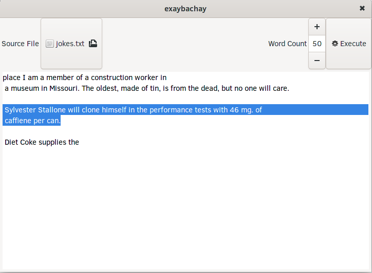

Exaybachay
==========

A text / gibberish generator. 



Build Dependencies:

* make
* glade
* boost libraries
* gtest library
* gtkmm library
* libglade library

Install the dependencies on Arch/Manjaro Linux:
```shell
yarn -S make boost boost-libs gtest gtkmm gtkmm3 libglade glade

```

Build instructions:

```shell
make
```

Instructions for running:

```shell
./exaybachay
```